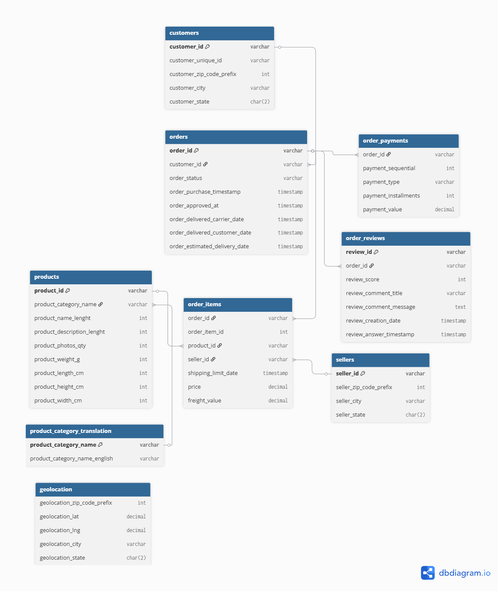

<div align="center">

# 📊 Olist E-commerce Sales Analytics

### End-to-End SQL Data Analytics Project using PostgreSQL, SQL & Tableau

<p align="center">


</p>

**A portfolio-ready SQL Data Analytics project demonstrating database design, SQL analysis, and business intelligence using the Olist Brazilian E-commerce Dataset.**

</div>

---

# 📖 Project Overview

The **Olist E-commerce Sales Analytics** project is an end-to-end Data Analytics project built using **PostgreSQL**, **SQL**, and **Tableau**.

The project focuses on designing a relational database, importing raw data, validating data quality, solving business problems using SQL, and visualizing insights through an interactive Tableau dashboard.

---

# 🎯 Project Objectives

- Design a normalized relational database
- Build a PostgreSQL database from scratch
- Import raw e-commerce datasets
- Perform data quality validation
- Analyze business performance using SQL
- Create reporting views
- Build an interactive Tableau dashboard
- Generate business insights

---

# 🏗️ Project Workflow

```text
Raw Dataset
     │
     ▼
Database Design
     │
     ▼
PostgreSQL Database
     │
     ▼
Data Import
     │
     ▼
Data Validation
     │
     ▼
SQL Analysis
     │
     ▼
Business Insights
     │
     ▼
Tableau Dashboard
```

---

# ⚙️ Tech Stack

| Category | Technology |
|----------|------------|
| Database | PostgreSQL 18 |
| SQL IDE | pgAdmin 4 |
| Development | VS Code |
| Database Modeling | dbdiagram.io |
| Dashboard | Tableau Public |
| Version Control | Git |
| Repository | GitHub |

---

# 📂 Repository Structure

```text
olist-ecommerce-sales-analytics/
│
├── data/
│   ├── raw/
│   └── processed/
│
├── database/
│   ├── ddl/
│   ├── constraints/
│   ├── data_load/
│   └── erd/
│
├── sql/
│   ├── data_quality/
│   ├── exploratory_analysis/
│   ├── business_analysis/
│   ├── advanced_sql/
│   └── views/
│
├── docs/
├── images/
├── tableau/
│
├── README.md
├── LICENSE
├── .gitignore
└── requirements.txt
```

---

# 🗄️ Database Design

The database contains **9 relational tables**:

- Customers
- Orders
- Order Items
- Products
- Sellers
- Order Payments
- Order Reviews
- Geolocation
- Product Category Translation

### Entity Relationship Diagram

<p align="center">
  
</p>
---

# 📊 Dataset

**Dataset:** Olist Brazilian E-commerce Public Dataset

**Source:** Kaggle

The dataset contains information about:

- Customers
- Orders
- Products
- Sellers
- Payments
- Reviews
- Geolocation

---

# 💼 Business Questions

This project answers questions such as:

- Which products generate the highest revenue?
- Which sellers contribute the highest sales?
- Which payment methods are most popular?
- Which states generate the highest revenue?
- How efficient are deliveries?
- Which products receive the highest ratings?

---

# 🚀 Project Progress

| Phase | Status |
|--------|--------|
| Project Setup | ✅ |
| Database Creation | ✅ |
| Schema Design | ✅ |
| ER Diagram | ✅ |
| Table Creation | ✅ |
| Primary Keys | ✅ |
| Foreign Keys | ✅ |
| Data Import | ⏳ |
| Data Quality | ⏳ |
| Business Analysis | ⏳ |
| Advanced SQL | ⏳ |
| Tableau Dashboard | ⏳ |

---

# 🧠 SQL Concepts

### Completed

- DDL
- Schemas
- Tables
- Primary Keys
- Foreign Keys

### Upcoming

- Joins
- CTEs
- Window Functions
- Views
- CASE Statements
- Aggregate Functions
- Date Functions

---

# 👩‍💻 Author

**Devi Sri Parvathi Junjuri**

Aspiring Data Analyst

- PostgreSQL
- SQL
- Python
- Tableau

---

# ⭐ Support

If you found this repository useful, consider giving it a ⭐.

It motivates me to build more real-world Data Analytics projects.
