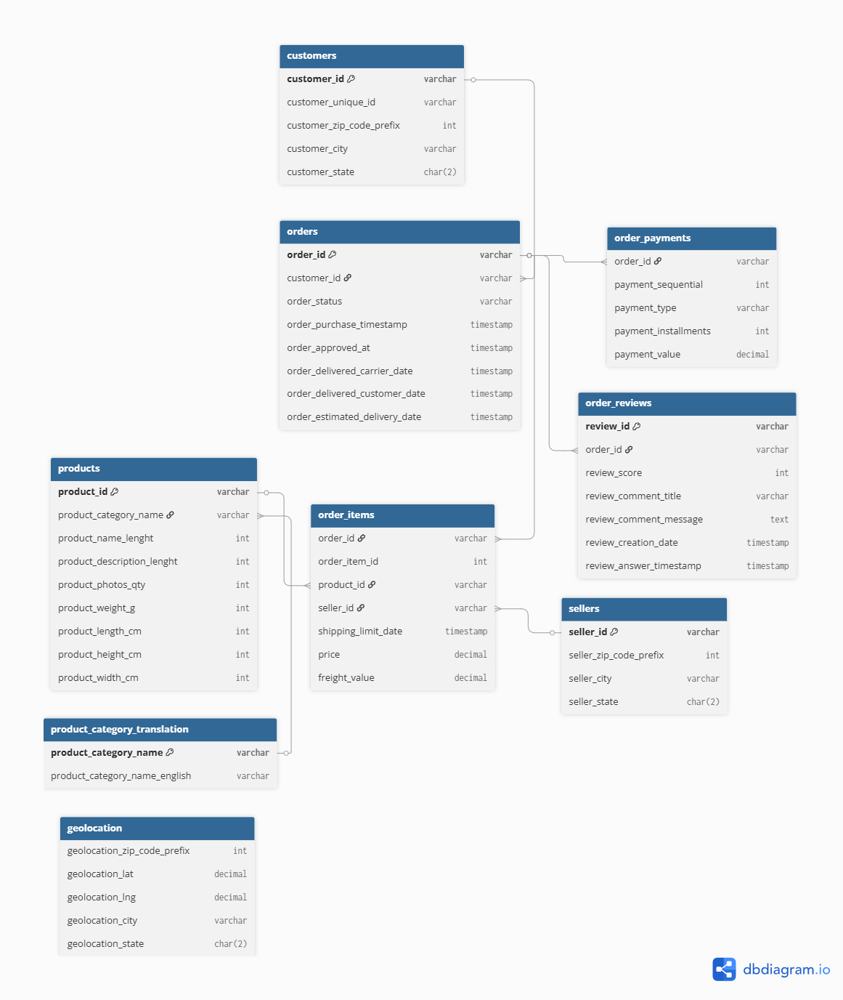
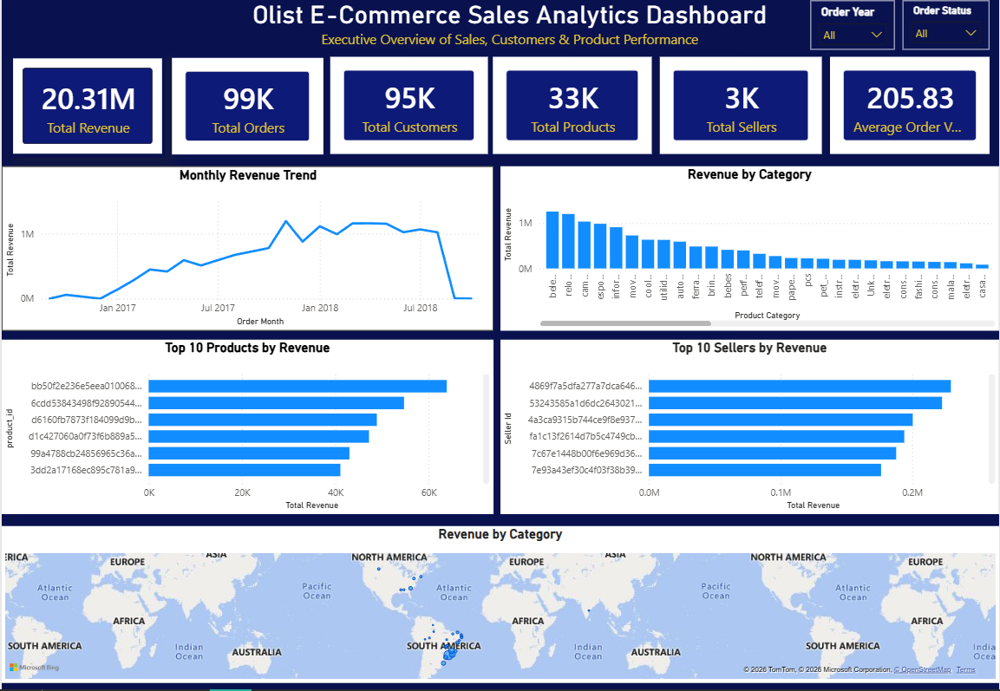
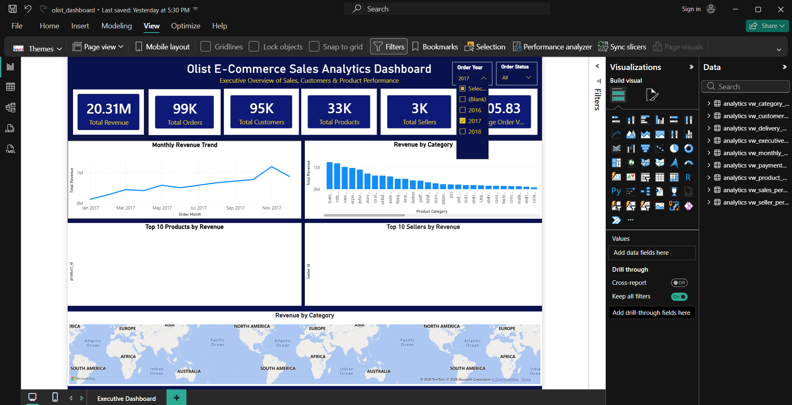
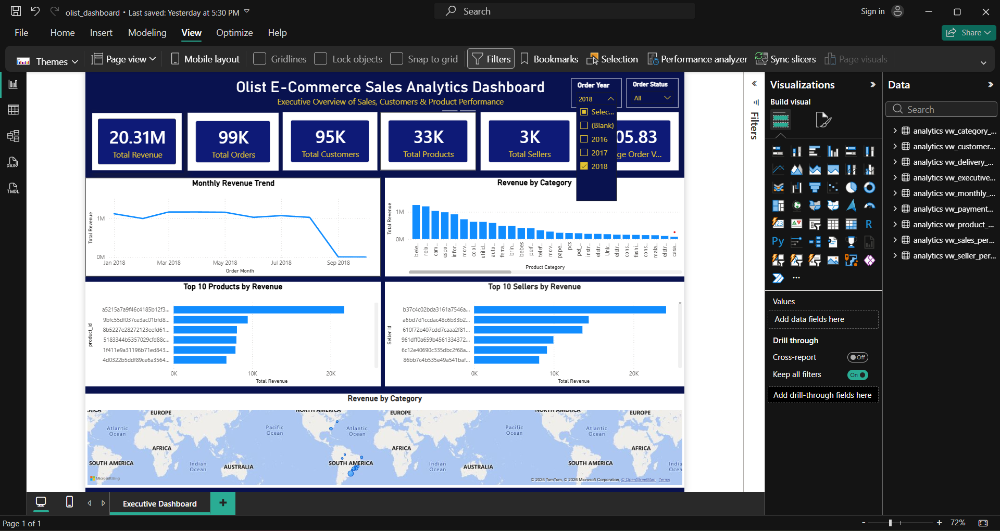

<div align="center">

# 📊 Olist E-Commerce Sales Analytics

### End-to-End SQL Data Analytics Project using PostgreSQL, SQL & Power BI

<p align="center">


</p>

**A portfolio-ready Data Analytics project demonstrating database design, SQL analysis, data validation, and interactive business intelligence using the Olist Brazilian E-Commerce Dataset.**

</div>

---

# 📖 Project Overview

The **Olist E-Commerce Sales Analytics** project is an end-to-end Data Analytics project built using **PostgreSQL, SQL, and Power BI**.

The project focuses on organizing a real-world e-commerce dataset into a relational database, performing data quality checks, analyzing business performance using SQL, and presenting the results through an interactive Power BI dashboard.

The project covers the complete flow from **raw data to business insights**.

---

# 🎯 Project Objectives

- Design a relational database for the Olist dataset
- Create and manage tables using PostgreSQL
- Import and validate e-commerce data
- Perform data quality checks using SQL
- Analyze sales and business performance
- Identify top products and sellers
- Analyze revenue by category and time
- Create SQL views for reporting
- Build an interactive Power BI dashboard
- Present important business insights clearly

---

# 🏗️ Project Workflow

```text
Raw Dataset
     │
     ▼
Database Design
     │
     ▼
PostgreSQL Database
     │
     ▼
Data Import
     │
     ▼
Data Quality Checks
     │
     ▼
SQL Analysis
     │
     ▼
Business Analysis
     │
     ▼
Power BI Dashboard
     │
     ▼
Business Insights
```

---

# ⚙️ Tech Stack

| Category | Technology |
|----------|------------|
| Database | PostgreSQL 18 |
| SQL | PostgreSQL SQL |
| SQL IDE | pgAdmin 4 |
| Development | VS Code |
| Database Modeling | dbdiagram.io |
| Dashboard | Microsoft Power BI |
| Calculations | DAX |
| Version Control | Git |
| Repository | GitHub |

---

# 📂 Repository Structure

```text
olist-ecommerce-sales-analytics/
│
├── data/
│   └── raw/
│
├── database/
│   ├── ddl/
│   ├── constraints/
│   ├── data_load/
│   └── erd/
│
├── sql/
│   ├── data_quality/
│   ├── exploratory_analysis/
│   ├── business_analysis/
│   ├── advanced_sql/
│   └── views/
│
├── powerbi/
│   └── Olist_Ecommerce_Sales_Analytics.pbix
│
├── images/
│   ├── olist_dashboard.png
│   ├── olist_dashboard_2017.png
│   ├── olist_dashboard_2018.png
│   └── olist_erd.png
│
├── docs/
│   └── Olist_Ecommerce_Sales_Analytics_Project_Documentation.docx
│
├── README.md
├── LICENSE
└── .gitignore
```

---

# 🗄️ Database Design

The database contains **9 relational tables**:

- Customers
- Orders
- Order Items
- Products
- Sellers
- Order Payments
- Order Reviews
- Geolocation
- Product Category Translation

### Entity Relationship Diagram

<div align="center">



</div>
The ERD shows the main tables, important columns, primary keys, foreign keys, and relationships used in the database.

---

# 📊 Dataset

### Dataset

**Brazilian E-Commerce Public Dataset by Olist**

The dataset contains information related to:

- 👥 Customers
- 📦 Orders
- 🛍️ Products
- 🏪 Sellers
- 💳 Payments
- ⭐ Reviews
- 📍 Geolocation
- 🏷️ Product Categories

The dataset was used to build the PostgreSQL database and perform the SQL analysis.

---

# 💼 Business Questions

The project focuses on questions such as:

- Which product categories generate the highest revenue?
- Which products generate the highest revenue?
- Which sellers contribute the highest revenue?
- How does revenue change over time?
- How many customers and orders are represented in the dataset?
- What is the average order value?
- How are customers or sales distributed geographically?
- How does performance change when filtering by order year?

---

# 🔍 SQL Analysis

SQL was used for both **data validation and business analysis**.

### Data Quality Checks

The project includes checks for:

- NULL values
- Duplicate records
- Record counts
- Missing values
- Table relationships
- Data consistency

### Business Analysis

SQL was used to analyze:

- Total revenue
- Total orders
- Total customers
- Total products
- Total sellers
- Revenue by category
- Top 10 products by revenue
- Top 10 sellers by revenue
- Monthly revenue trends
- Geographic distribution

---

# 📈 Power BI Dashboard

The final Power BI dashboard provides a simple overview of the main e-commerce performance metrics.

### Dashboard Preview

<div align="center">



</div>

---

## 📌 Dashboard KPIs

| KPI | Value |
|-----|------:|
| 💰 Total Revenue | **20.31M** |
| 📦 Total Orders | **99K** |
| 👥 Total Customers | **95K** |
| 🛍️ Total Products | **33K** |
| 🏪 Total Sellers | **3K** |
| 💵 Average Order Value | **205.83** |

---

## 📊 Dashboard Visuals

The dashboard includes:

- 📌 KPI cards
- 📈 Monthly Revenue Trend
- 🏷️ Revenue by Product Category
- 🛍️ Top 10 Products by Revenue
- 🏪 Top 10 Sellers by Revenue
- 🗺️ Geographic Analysis
- 🔽 Order Year Slicer

---

# 🔽 Interactive Dashboard

The dashboard includes an **Order Year slicer**.

Selecting a year changes the KPI values and visualizations according to the selected period.

### 2017 Filter

<div align="center">



</div>

### 2018 Filter

<div align="center">



</div>

These filtered views demonstrate the interactive nature of the Power BI dashboard.

---

# 💡 Key Findings

Some important observations from the analysis include:

- The dashboard shows approximately **20.31M in total revenue**.
- The dataset contains approximately **99K orders**.
- Approximately **95K customers** are represented in the data.
- The dataset contains approximately **33K products** and **3K sellers**.
- The average order value shown on the dashboard is **205.83**.
- Revenue varies across different product categories.
- Some products contribute significantly more revenue than others.
- Top-performing sellers contribute a large share of marketplace revenue.
- Revenue changes over time and can be explored using the monthly trend.
- The Order Year slicer allows users to compare performance across different years.

---

# 🚀 Project Progress

| Phase | Status |
|-------|--------|
| Project Setup | ✅ |
| Database Creation | ✅ |
| Schema Design | ✅ |
| ER Diagram | ✅ |
| Table Creation | ✅ |
| Primary Keys | ✅ |
| Foreign Keys | ✅ |
| Data Import | ✅ |
| Data Quality Checks | ✅ |
| Exploratory Analysis | ✅ |
| Business Analysis | ✅ |
| SQL Views | ✅ |
| Power BI Dashboard | ✅ |
| Project Documentation | ✅ |

---

# 🧠 SQL Concepts Used

The project includes practical use of:

- DDL
- DML
- SELECT queries
- Filtering
- Sorting
- Aggregate Functions
- GROUP BY
- HAVING
- JOINs
- CASE Statements
- Date Functions
- String Functions
- Subqueries
- CTEs
- Window Functions
- Views
- Data Quality Queries

---

# 📚 Learning Outcomes

Through this project, I gained practical experience in:

- Designing a relational database
- Working with PostgreSQL
- Writing SQL queries for business analysis
- Performing data quality checks
- Working with multiple related tables
- Creating SQL views
- Creating Power BI dashboards
- Creating KPIs using DAX
- Building interactive filters
- Presenting data-driven business insights
- Documenting an end-to-end analytics project

---

# 📄 Project Documentation

Detailed documentation covering the database design, SQL analysis, Power BI dashboard, findings, and project workflow is available below.

📘 **[View Project Documentation](docs/Olist_Ecommerce_Sales_Analytics_Project_Documentation.docx)**

---

# 👩‍💻 Author

### Devi Sri Parvathi Junjuri

**Aspiring Data Analyst**

**Skills:**

- PostgreSQL
- SQL
- Python
- Power BI
- Tableau
- Data Analytics

---

# ⭐ Support

If you found this project useful or interesting, consider giving the repository a ⭐.

</div>